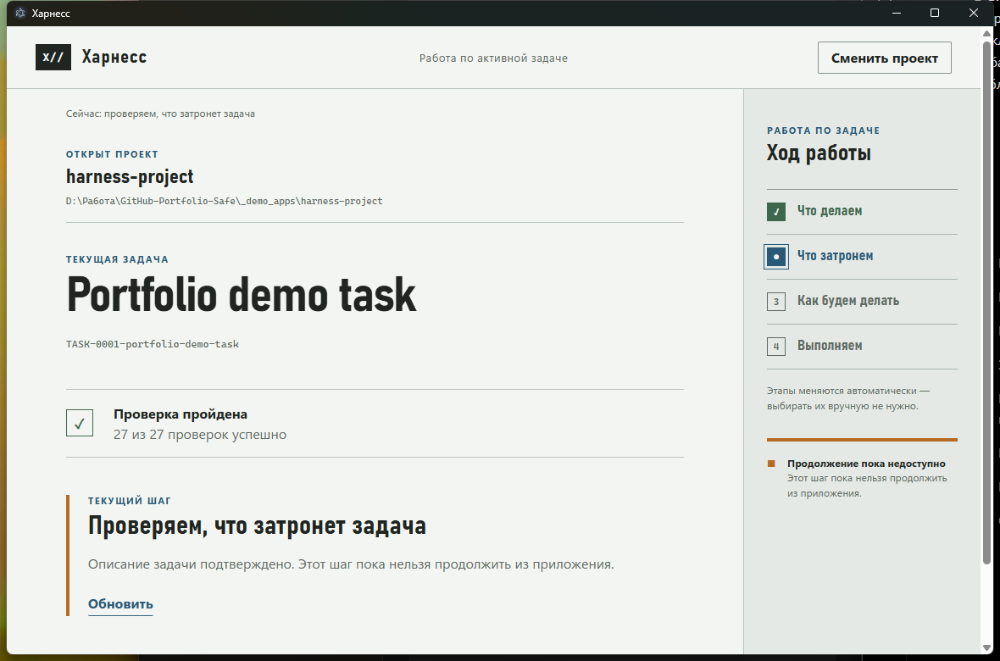

# SERGO Harness

**Architecture-aware development harness for controlled AI-assisted software work.**

**Source code:** Private  
**Status:** Active development

SERGO Harness is an internal developer tool built to make AI-assisted development more controlled, inspectable and reproducible.

## What it focuses on
- task lifecycle and explicit project state;
- gated transitions before implementation;
- architecture/impact analysis before changes;
- bounded execution and fail-closed behavior;
- Git/evidence-based verification;
- CLI and desktop workflows;
- deterministic automated testing.

## Interface

This screenshot uses a disposable demo project created only for the portfolio. It contains no production repository paths, credentials, private task records or personal data.

## Verified state
On **2026-09-14**, the local automated test suite completed with **432 passed, 0 failed**.

## Why I built it
I wanted a development environment that does not treat an AI coding agent as unrestricted authority. The harness separates intent, evidence, state transitions and human approval boundaries.

## Technology
Node.js · JavaScript · Electron · Git · automated testing

## Portfolio note
This repository is a public case study only. The production source, internal task records, evidence artifacts, credentials and local project data are intentionally not published.