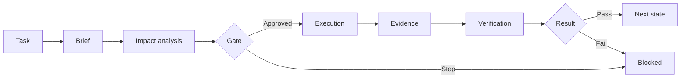

# SERGO Harness

**Architecture-aware development harness for controlled AI-assisted software work.**

## Problem

AI coding tools are fast, but unrestricted execution makes complex projects harder to control: task state can drift, architecture impact can be missed, evidence becomes fragmented, and “done” does not always mean verified.

## Solution

SERGO Harness adds an explicit control layer around AI-assisted development:

- task lifecycle with explicit project state;
- gates and human approval boundaries;
- architecture / impact analysis before implementation;
- bounded execution and fail-closed behavior;
- Git- and evidence-based verification;
- CLI and desktop workflows;
- deterministic automated testing.

## Workflow

## Interface

The screenshot uses a disposable demo project created only for the portfolio. It contains no production repository paths, credentials, private task records or personal data.

## Verified result

> **432 passed · 0 failed**

The local automated test suite completed successfully on **2026-09-14**.

## Why it matters

The goal is not to make an AI agent unrestricted authority. The harness separates:

**intent → impact → approval → execution → evidence → verification**

That makes changes more inspectable, reproducible and easier to stop when required evidence is missing.

## Technology

**Node.js · JavaScript · Electron · Git · CLI tooling · automated testing**

## Current status

Active development. The production source remains private while this repository serves as a technical case study.

## Security boundary

This showcase intentionally excludes production source code, private task records, evidence artifacts, credentials, local paths and personal project data.
